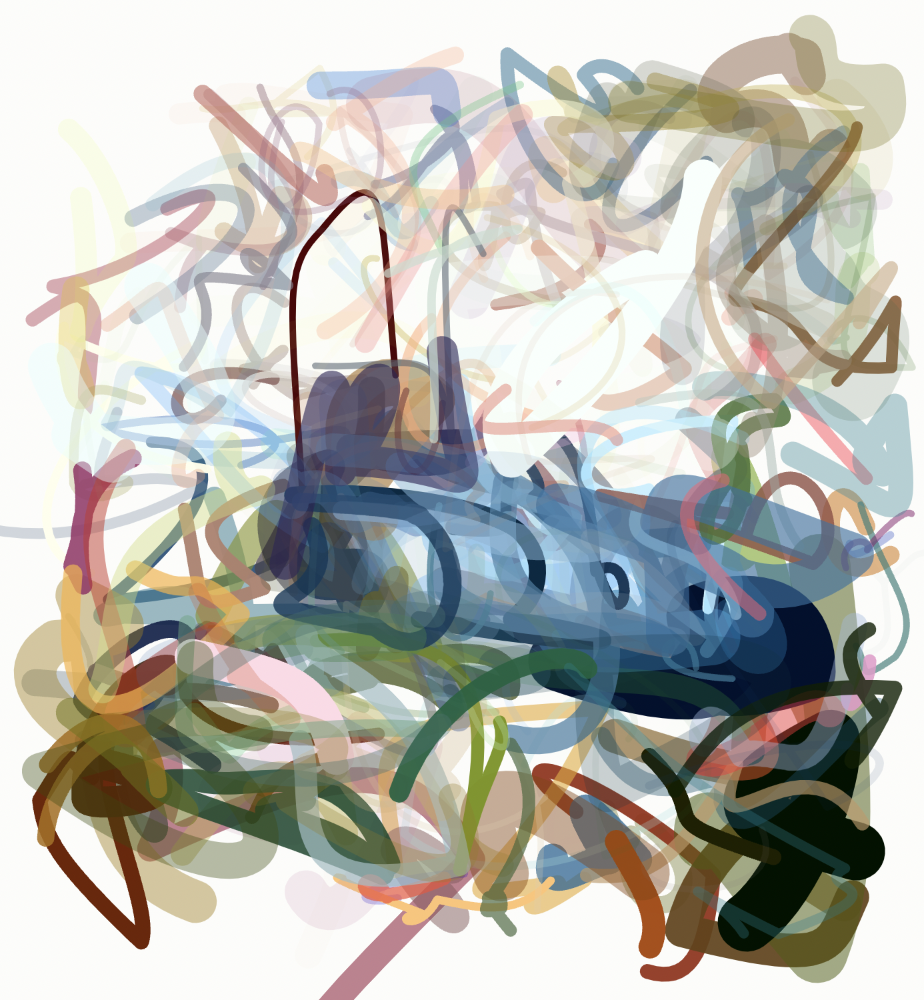

# CLIPDraw Interactive



## Run locally

```sh
export REPLICATE_API_TOKEN=<my-api-token>
python app.py
```

Open https://localhost:5000 and see a rendering of a submarine.

The prediction ID is hardcoded in index.js. To get a new prediction ID, update the prompt in app.py and run the following snippet from the javacript console:

```js
window.fetch(
  "/api/start", {
    method: "POST",
  }
).then(function(resp) {
  return resp.json();
}).then(function(resp) {
  console.log(resp);
});
```
