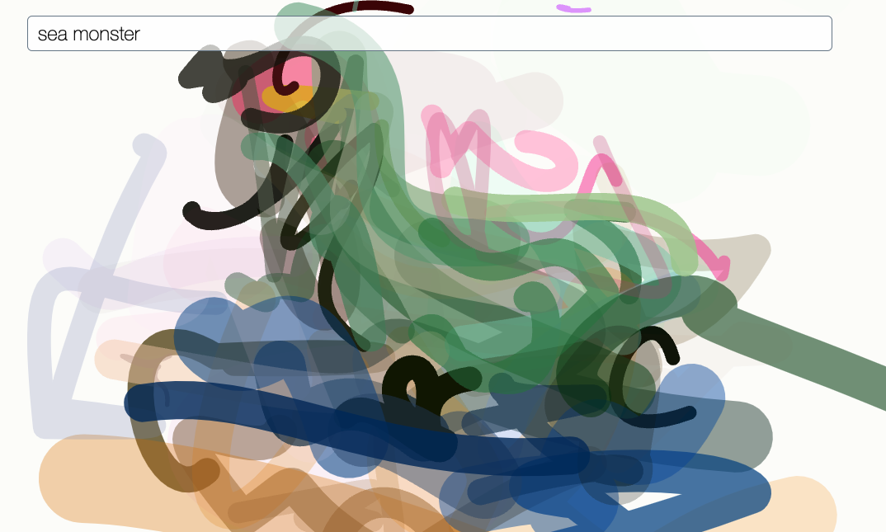

# Interactive CLIPDraw



Interactive version of [CLIPDraw](https://replicate.com/kvfrans/clipdraw), running on https://interactive-clip-draw.vercel.app/

## Install dependencies

### venv

```sh
python3 -m venv .venv
source .venv/bin/activate
pip install -r requirements.txt
```

### conda

```sh
conda create -n clipdraw "python=3.8"
conda activate clipdraw
pip install -r requirements.txt
```

## Run locally

```sh
export REPLICATE_API_TOKEN=<my-api-token>
python app.py
```

Open https://localhost:5000.

## Deploy

Interactive CLIPDraw is deployed on [Vercel](https://vercel.com).

To deploy your own version:
* Create an account on Vercel
* Install the [Vercel CLI](https://vercel.com/docs/cli)
* `vercel login`
* `vercel --prod`
